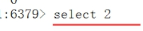

# 1. Redis介绍

## 1.1. Redis简介

Redis 是完全开源免费的，遵守BSD协议，是一个高性能(NOSQL)的key-value数据库,Redis是一个开源的使用ANSI [C](https://baike.baidu.com/item/C语言)[语言](https://baike.baidu.com/item/C语言)编写、支持网络、可基于内存亦可持久化的日志型、Key-Value[数据库](https://baike.baidu.com/item/数据库)，并提供多种语言的API。从2010年3月15日起，Redis的开发工作由VMware主持。从2013年5月开始，Redis的开发由Pivotal赞助。(Vmware在资助着redis项目的开发和维护)

[BSD](https://baike.baidu.com/item/BSD)是"Berkeley Software Distribution"的缩写，[意思](https://baike.baidu.com/item/意思)是"伯克利软件发行版"。

BSD开源协议是一个给于使用者很大自由的协议。可以自由的使用，修改源代码，也可以将修改后的代码作为开源或者专有软件再发布。BSD代码鼓励代码共享，但需要尊重代码作者的著作权。BSD由于允许使用者修改和重新发布代码，也允许使用或在BSD代码上开发商业软件发布和销售，因此是对商业集成很友好的协议。

## 1.2. Redis作者

redis的作者，他叫Salvatore Sanfilippo，来自意大利的西西里岛，现在居住在卡塔尼亚。目前供职于Pivotal公司。

 

地址是antirez.com，当然也可以去follow他的github，地址是http://github.com/antirez。

## 1.3. NoSQL介绍

NoSQL，泛指非关系型的数据库。随着互联网[web2.0](https://baike.baidu.com/item/web2.0)网站的兴起，传统的关系数据库在应付web2.0网站，特别是超大规模和高并发的[SNS](https://baike.baidu.com/item/SNS/10242)类型的web2.0纯[动态网](https://baike.baidu.com/item/动态网)站已经显得力不从心，暴露了很多难以克服的问题，而非关系型的数据库则由于其本身的特点得到了非常迅速的发展。NoSQL数据库的产生就是为了解决大规模数据集合多重数据种类带来的挑战，尤其是大数据应用难题。 

### 1.3.1. NoSQL数据库的四大分类 

键值([Key-Value](https://baike.baidu.com/item/Key-Value))存储[数据库](https://baike.baidu.com/item/数据库)
     结构：这一类数据库主要会使用到一个[哈希表](https://baike.baidu.com/item/哈希表)，这个表中有一个特定的键和一个指针指向特定的数据。			  	 优势：Key/value模型对于IT系统来说的优势在于简单、易部署。
	 缺点：如果[DBA](https://baike.baidu.com/item/DBA/3349)只对部分值进行查询或更新的时候，Key/value就显得效率低下了。
	 案例：Tokyo Cabinet/Tyrant, Redis, Voldemort, Oracle BDB.

列存储数据库
    用途：这部分数据库通常是用来应对分布式存储的海量数据。
	特点：键仍然存在，但是它们的特点是指向了多个列。这些列是由列家族来安排的。
	案例：Cassandra, HBase, Riak.

文档型数据库
    起源：文档型数据库的灵感是来自于Lotus Notes办公软件的，而且它同第一种键值存储相类似。
	结构：该类型的数据模型是版本化的文档，半结构化的文档以特定的格式存储，比如JSON。
	特点：文档型数据库可 以看作是键值数据库的升级版，允许之间嵌套键值。而且文档型数据库比键值数据库的				查询效率更高。
	案例：CouchDB, MongoDb. 国内也有文档型数据库SequoiaDB，已经开源。

图形(Graph)数据库
    结构：图形结构的数据库同其他行列以及刚性结构的SQL数据库不同，它是使用灵活的图形模型，并且能够扩展				到多个服务器上。NoSQL数据库没有标准的查询语言(SQL)，因此进行数据库查询需要制定数据模型。许				多NoSQL数据库都有REST式的数据接口或者查询API。
	案例：Neo4J, InfoGrid, Infinite Graph.

   因此，我们总结NoSQL数据库在以下的这几种情况下比较适用：

+ 数据模型比较简单；
+ 需要灵活性更强的IT系统；
+ 对数据库性能要求较高；
+ 不需要高度的数据一致性；
+ 对于给定key，比较容易映射复杂值的环境。

Redis 与其他 key - value 缓存产品有以下三个特点：

+ Redis支持数据的持久化，可以将内存中的数据保存在磁盘中，重启的时候可以再次加载进行使用。

+ Redis不仅仅支持简单的key-value类型的数据，同时还提供list，set，zset，hash等数据结构的存储。

- Redis支持数据的备份，集群等高可用功能。

## 1.4. 特点

+ 性能极高 – Redis能读的速度是110000次/s,写的速度是81000次/s 。

+ 丰富的数据类型 – Redis支持的类型 String, List, Hash, Set 及 Ordered Set 数据类型操作。

+ 原子 – Redis的所有操作都是原子性的，意思就是要么成功执行要么失败完全不执行。单个操作是原子性的。多个操作也支持事务，即原子性，通过MULTI和EXEC指令包起来。

+ 丰富的特性 – Redis还支持 publish/subscribe, 通知, key 过期等等特性。

Redis是一个简单的，高效的，分布式的，基于内存的缓存工具。 
架设好服务器后，通过网络连接（类似数据库），提供Key－Value式缓存服务。

简单，是Redis突出的特色。 
简单可以保证核心功能的稳定和优异。 

## 1.5. Redis总结

redis单个key 存入512M大小

redis支持多种类型的数据结构(string,list,hash.set.zset)

redis 是单线程  原子性   

redis可以持久化  因为使用了 RDB和AOF机制  

redis支持集群  而且redis 支持库(0-15) 16个库 

redis 还可以做消息队列  比如聊天室  IM 

企业级开发中:可以用作数据库、缓存(热点数据（经常会被查询，但是不经常被修改或者删除的数据)和消息中间件等大部分功能。

优点： 

1. 丰富的数据结构

2. 高速读写，redis使用自己实现的分离器，代码量很短，没有使用lock（MySQL），因此效率非常高。

缺点： 

1. 持久化。Redis直接将数据存储到内存中，要将数据保存到磁盘上，Redis可以使用两种方式实现持久化过程。定时快照（snapshot）：每隔一段时间将整个数据库写到磁盘上，每次均是写全部数据，代价非常高。第二种方式基于语句追加（aof）：只追踪变化的数据，但是追加的log可能过大，同时所有的操作均重新执行一遍，回复速度慢。 
2. 耗内存，占用内存过高。 

# 2. Redis安装

## 2.1. Windows安装

https://jingyan.baidu.com/article/0f5fb099045b056d8334ea97.html

## 2.2. Linux安装

官方网站：http://redis.io/ 

官方下载：http://redis.io/download 可以根据需要下载不同版本 

（域名后缀io属于国家域名，是british Indian Ocean territory，即英属印度洋领地）

Redis是C语言开发，安装Redis需要先将官网下载的源码进行编译，编译依赖gcc环境，如果没有gcc环境，需要安装gcc 

 

### 2.2.1. 安装gcc

gcc的安装很简单，首先要确保root登录，其次就是Linux要能连外网

注意：运行yum时出现/var/run/yum.pid已被锁定,PID为xxxx的另一个程序正在运行的问题解决

### 2.2.2. 安装Redis

命令1： wget http://download.redis.io/releases/redis-4.0.1.tar.gz

命令2：tar zxvf redis-4.0.1.tar.gz

命令3： cd redis-4.0.1

命令4（编译）： make  或 make MALLOC=libc   如下图代表成功：

 

命令5：make PREFIX=/usr/local/redis install

（安装编译后的文件） 安装到指目录： 

注意：PREFIX必须大写、同时会自动为我们创建redis目录，并将结果安装此目录

命令6： cd /usr/local/redis 查看

命令7：查看bin目录下，如图：

 

# 3. Redis启动

## 3.1. 启动Redis服务

 进入对应的安装目录 /usr/local/redis

 执行命令： ./bin/redis-server

 

## 3.2. 启动Redis客户端

进入Redis客服端（Clone Session克隆一个窗口）：

 进入对应的安装目录 cd  /usr/local/redis

 执行命令： ./bin/redis-cli

 

启动Redis 客户端命令：

  redis-cli –h IP地址 –p 端口

退出客户端命令：Ctrl+C   

检测是否服务端启动

启动 redis 客户端，打开终端并输入命令 redis-cli。该命令会连接本地的 redis 服务。

$redis-cli

redis 127.0.0.1:6379>

redis 127.0.0.1:6379> PING

PONG

在以上实例中我们连接到本地的 redis 服务并执行 PING 命令，该命令用于检测 redis 服务是否启动。 

# 4. Linux配置Redis

Redis 的配置文件位于 Redis 安装目录下，文件名为 redis.conf(Windows 名为 redis.windows.conf)。

## 4.1. 配置Redis

Redis端口号或启动有默认配置。但一般我们都会通过手动配置完成

回到根目录找到解压文件中的reids.conf

 

命令：cp redis.conf /usr/local/redis 将配置文件复制到安装文件的目录下

 

Redis配置至此全部完成 

## 4.2. redis.conf 配置文件详解

redis.conf 配置项说明如下：

1. Redis默认不是以守护进程的方式运行，可以通过该配置项修改，使用yes启用守护进程

  daemonize no

2. 当Redis以守护进程方式运行时，Redis默认会把pid写入/var/run/redis.pid文件，可以通过pidfile指定

  pidfile /var/run/redis.pid

3. 指定Redis监听端口，默认端口为6379，为什么选用6379作为默认端口，因为6379在手机按键上MERZ对应的号码，而MERZ取自意大利歌女Alessia Merz的名字

  port 6379

4. 绑定的主机地址

  bind 127.0.0.1

5. 当 客户端闲置多长时间后关闭连接，如果指定为0，表示关闭该功能

  timeout 300

6. 指定日志记录级别，Redis总共支持四个级别：debug、verbose、notice、warning，默认为verbose

  loglevel verbose

7. 日志记录方式，默认为标准输出，如果配置Redis为守护进程方式运行，而这里又配置为日志记录方式为标准输出，则日志将会发送给/dev/null

  logfile stdout

8. 设置数据库的数量，默认数据库为0，可以使用SELECT <dbid>命令在连接上指定数据库id

  databases 16

9. 指定在多长时间内，有多少次更新操作，就将数据同步到数据文件，可以多个条件配合

  save  

  Redis默认配置文件中提供了三个条件：

  save 900 1

  save 300 10

  save 60 10000

  分别表示900秒（15分钟）内有1个更改，300秒（5分钟）内有10个更改以及60秒内有10000个更改。

10. 指定存储至本地数据库时是否压缩数据，默认为yes，Redis采用LZF压缩，如果为了节省CPU时间，可以关闭该选项，但会导致数据库文件变的巨大

  rdbcompression yes

11. 指定本地数据库文件名，默认值为dump.rdb

  dbfilename dump.rdb

12. 指定本地数据库存放目录

  dir ./

13. 设置当本机为slav服务时，设置master服务的IP地址及端口，在Redis启动时，它会自动从master进行数据同步

  slaveof  

14. 当master服务设置了密码保护时，slav服务连接master的密码

  masterauth 

15. 设置Redis连接密码，如果配置了连接密码，客户端在连接Redis时需要通过AUTH 命令提供密码，默认关闭

  requirepass foobared

16. 设置同一时间最大客户端连接数，默认无限制，Redis可以同时打开的客户端连接数为Redis进程可以打开的最大文件描述符数，如果设置 maxclients 0，表示不作限制。当客户端连接数到达限制时，Redis会关闭新的连接并向客户端返回max number of clients reached错误信息

  maxclients 128

17. 指定Redis最大内存限制，Redis在启动时会把数据加载到内存中，达到最大内存后，Redis会先尝试清除已到期或即将到期的Key，当此方法处理 后，仍然到达最大内存设置，将无法再进行写入操作，但仍然可以进行读取操作。Redis新的vm机制，会把Key存放内存，Value会存放在swap区

  maxmemory 

18. 指定是否在每次更新操作后进行日志记录，Redis在默认情况下是异步的把数据写入磁盘，如果不开启，可能会在断电时导致一段时间内的数据丢失。因为 redis本身同步数据文件是按上面save条件来同步的，所以有的数据会在一段时间内只存在于内存中。默认为no

  appendonly no

19. 指定更新日志文件名，默认为appendonly.aof

   appendfilename appendonly.aof

20. 指定更新日志条件，共有3个可选值： 
      no：表示等操作系统进行数据缓存同步到磁盘（快） 
      always：表示每次更新操作后手动调用fsync()将数据写到磁盘（慢，安全） 
      everysec：表示每秒同步一次（折中，默认值）

  appendfsync everysec

21. 指定是否启用虚拟内存机制，默认值为no，简单的介绍一下，VM机制将数据分页存放，由Redis将访问量较少的页即冷数据swap到磁盘上，访问多的页面由磁盘自动换出到内存中（在后面的文章我会仔细分析Redis的VM机制）

   vm-enabled no

22. 虚拟内存文件路径，默认值为/tmp/redis.swap，不可多个Redis实例共享

   vm-swap-file /tmp/redis.swap

23. 将所有大于vm-max-memory的数据存入虚拟内存,无论vm-max-memory设置多小,所有索引数据都是内存存储的(Redis的索引数据 就是keys),也就是说,当vm-max-memory设置为0的时候,其实是所有value都存在于磁盘。默认值为0

   vm-max-memory 0

24. Redis swap文件分成了很多的page，一个对象可以保存在多个page上面，但一个page上不能被多个对象共享，vm-page-size是要根据存储的 数据大小来设定的，作者建议如果存储很多小对象，page大小最好设置为32或者64bytes；如果存储很大大对象，则可以使用更大的page，如果不 确定，就使用默认值

   vm-page-size 32

25. 设置swap文件中的page数量，由于页表（一种表示页面空闲或使用的bitmap）是在放在内存中的，在磁盘上每8个pages将消耗1byte的内存。

   vm-pages 134217728

26. 设置访问swap文件的线程数,最好不要超过机器的核数,如果设置为0,那么所有对swap文件的操作都是串行的，可能会造成比较长时间的延迟。默认值为4

   vm-max-threads 4

27. 设置在向客户端应答时，是否把较小的包合并为一个包发送，默认为开启

  glueoutputbuf yes

28. 指定在超过一定的数量或者最大的元素超过某一临界值时，采用一种特殊的哈希算法

  hash-max-zipmap-entries 64

  hash-max-zipmap-value 512

29. 指定是否激活重置哈希，默认为开启（后面在介绍Redis的哈希算法时具体介绍）

  activerehashing yes

30. 指定包含其它的配置文件，可以在同一主机上多个Redis实例之间使用同一份配置文件，而同时各个实例又拥有自己的特定配置文件

  include /path/to/local.conf

Redis中的内存维护策略

redis作为优秀的中间缓存件，时常会存储大量的数据，即使采取了集群部署来动态扩容，也应该及时的整理内存，维持系统性能。

在redis中有两种解决方案，

一是为数据设置超时时间，

二是采用LRU算法动态将不用的数据删除。内存管理的一种页面置换算法，对于在内存中但又不用的数据块（内存块）叫做LRU，操作系统会根据哪些数据属于LRU而将其移出内存而腾出空间来加载另外的数据
1.volatile-lru：设定超时时间的数据中,删除最不常使用的数据.

2.allkeys-lru：查询所有的key中最近最不常使用的数据进行删除，这是应用最广泛的策略.

3.volatile-random：在已经设定了超时的数据中随机删除.

4.allkeys-random：查询所有的key,之后随机删除.

5.volatile-ttl：查询全部设定超时时间的数据,之后排序,将马上将要过期的数据进行删除操作.

6.noeviction：如果设置为该属性,则不会进行删除操作,如果内存溢出则报错返回.

7.volatile-lfu：从所有配置了过期时间的键中驱逐使用频率最少的键

8.allkeys-lfu：从所有键中驱逐使用频率最少的键

https://www.jianshu.com/p/c8aeb3eee6bc

## 4.3. 自定义配置Redis

1、进入对应的安装目录 /usr/local/redis

修改 redis.conf 配置文件  vim redis.conf  (进入命令模式  通过/内容  查找相应字符串）

2、Redis配置默认必须修改： 

daemonize no  修改为 daemonize yes 

bind 127.0.0.1  注释掉        

requirepass 设置密码         

  Redis采用的是单进程多线程的模式。当redis.conf中选项daemonize设置成yes时，代表开启守护进程模式。在该模式下，redis会在后台运行，并将进程pid号写入至redis.conf选项pidfile设置的文件中，此时redis将一直运行，除非手动kill该进程。但当daemonize选项设置成no时，当前界面将进入redis的命令行界面，exit强制退出或者关闭连接工具(putty,xshell等)都会导致redis进程退出。
服务端开发的大部分应用都是采用后台运行的模式 

# 5. Redis启动

## 5.1. 服务端启动

./bin/redis-server ./redis.conf

## 5.2. 客户端启动

### 5.2.1. 本地客户端登录

用redis-cli 密码登陆（redis-cli -a  password） 

### 5.2.2. 远程服务上执行命令

如果需要在远程 redis 服务上执行命令，同样我们使用的也是 redis-cli 命令。

语法：

redis-cli -h host -p port -a password

redis-cli –h IP地址 –p 端口 –a 密码

# 6. Redis关闭

第一种关闭方式：（断电、非正常关闭。容易数据丢失）

查询PID  ps -ef | grep -i redis

kill -9 PID

第二种关闭方式（正常关闭、数据保存）

./bin/redis-cli shutdown   关闭redis服务，通过客户端进行shutdown

如果redis设置了密码，需要先在客户端通过密码登录，再进行shutdown即可关闭服务端

 

通过 ps –ef | grep –i redis  查看当前进程：

 

# 7. Redis命令描述

Redis 命令用于在 redis 服务上执行操作。

要在 redis 服务上执行命令需要一个 redis 客户端。

Redis 客户端在我们之前下载的的 redis 的安装包中。

Redis支持五种数据类型：string（字符串），hash（哈希），list（列表），set（集合）及zset(sorted set：有序集合)等

## 7.1. Redis键key

Redis 键命令用于管理 redis 的键

### 7.1.1.DEL key

该命令用于在 key 存在时删除 key。

**返回值**

被删除 key 的数量。 

**实例**

首先，我们在 redis 中创建一个 key 并设置值。

```redis
redis 127.0.0.1:6379> SET w3ckey redis
OK
```

现在我们删除已创建的 key。

```redis
redis 127.0.0.1:6379> DEL w3ckey
(integer) 1
```


### 7.1.2.DUMP key

序列化给定 key ，并返回被序列化的值。

**返回值**

如果 key 不存在，那么返回 nil 。 否则，返回序列化之后的值。

**实例**

首先，我们在 redis 中创建一个 key 并设置值。

```redis
redis> SET greeting "hello, dumping world!"
OK
```

现在使用 DUMP 序列化键值。

```redis
redis> DUMP greeting
"\x00\x15hello, dumping world!\x06\x00E\xa0Z\x82\xd8r\xc1\xde"

redis> DUMP not-exists-key
(nil)
```


### 7.1.3.EXISTS key

检查给定 key 是否存在。 

**返回值**

若 key 存在返回 1 ，否则返回 0 。

**实例**

```redis
redis 127.0.0.1:6379> EXISTS runoob-new-key
(integer) 0
```

现在我们创建一个名为 runoob-new-key 的键并赋值，再使用 EXISTS 命令。

```redis
redis 127.0.0.1:6379> set runoob-new-key newkey
OK
redis 127.0.0.1:6379> EXISTS runoob-new-key
(integer) 1
redis 127.0.0.1:6379>
```

### 7.1.4.EXPIRE key seconds

为给定 key 设置过期时间（以秒计）。 

**返回值**

设置成功返回 1 。 当 key 不存在或者不能为 key 设置过期时间时(比如在低于 2.1.3 版本的 Redis 中你尝试更新 key 的过期时间)返回 0 。

**实例**

首先创建一个 key 并赋值：

```redis
redis 127.0.0.1:6379> SET runooobkey redis
OK
```

为 key 设置过期时间：

```redis
redis 127.0.0.1:6379> EXPIRE runooobkey 60
(integer) 1
```

以上实例中我们为键 runooobkey 设置了过期时间为 1 分钟，1分钟后该键会自动删除。

### 7.1.5.PEXPIRE key milliseconds

设置 key 的过期时间以毫秒计。

**返回值**

设置成功，返回 1

key 不存在或设置失败，返回 0

**实例**

首先创建一个 key 并赋值：

```redis
redis> SET mykey "Hello"
"OK"
redis> PEXPIRE mykey 1500
(integer) 1
redis> TTL mykey
(integer) 1
redis> PTTL mykey
(integer) 1498
redis> 
```

### 7.1.6.TTL key

以秒为单位，返回给定 key 的剩余生存时间(TTL, time to live) 

**返回值**

当 key 不存在时，返回 -2 。 当 key 存在但没有设置剩余生存时间时，返回 -1 。 否则，以秒为单位，返回 key 的剩余生存时间。

注意：在 Redis 2.8 以前，当 key 不存在，或者 key 没有设置剩余生存时间时，命令都返回 -1 。

**实例**

```redis
# 不存在的 key

redis> FLUSHDB
OK

redis> TTL key
(integer) -2


# key 存在，但没有设置剩余生存时间

redis> SET key value
OK

redis> TTL key
(integer) -1


# 有剩余生存时间的 key

redis> EXPIRE key 10086
(integer) 1

redis> TTL key
(integer) 10084
```

### 7.1.7.PTTL key

以毫秒为单位返回 key 的剩余的过期时间。

**返回值**

当 key 不存在时，返回 -2 。 当 key 存在但没有设置剩余生存时间时，返回 -1 。 否则，以毫秒为单位，返回 key 的剩余生存时间。

注意：在 Redis 2.8 以前，当 key 不存在，或者 key 没有设置剩余生存时间时，命令都返回 -1 。

**实例**

```redis
# 不存在的 key

redis> FLUSHDB
OK

redis> PTTL key
(integer) -2


# key 存在，但没有设置剩余生存时间

redis> SET key value
OK

redis> PTTL key
(integer) -1


# 有剩余生存时间的 key

redis> PEXPIRE key 10086
(integer) 1

redis> PTTL key
(integer) 6179
```

### 7.1.8.PERSIST key

移除 key 的过期时间，key 将持久保持。 

**返回值**

当过期时间移除成功时，返回 1 。 如果 key 不存在或 key 没有设置过期时间，返回 0 。

**实例**

```redis
redis> SET mykey "Hello"
OK

redis> EXPIRE mykey 10  # 为 key 设置生存时间
(integer) 1

redis> TTL mykey
(integer) 10

redis> PERSIST mykey    # 移除 key 的生存时间
(integer) 1

redis> TTL mykey
(integer) -1
```

### 7.1.9.KEYS pattern

查找所有符合给定模式( pattern)的 key 。 

**返回值**

符合给定模式的 key 列表 (Array)。

**实例**

首先创建一些 key，并赋上对应值：

```redis
redis 127.0.0.1:6379> SET runoob1 redis
OK
redis 127.0.0.1:6379> SET runoob2 mysql
OK
redis 127.0.0.1:6379> SET runoob3 mongodb
OK
```

查找以 runoob 为开头的 key：

```redis
redis 127.0.0.1:6379> KEYS runoob*
1) "runoob3"
2) "runoob1"
3) "runoob2"
```

获取 redis 中所有的 key 可用使用 *。

```redis
redis 127.0.0.1:6379> KEYS *
1) "runoob3"
2) "runoob1"
3) "runoob2"
```

keys 通配符   获取所有与pattern匹配的key,返回所有与该匹配 

通配符： 

​     *  代表所有 

​     ？ 表示代表一个字符 

7.1.10.RENAME key newkey

修改Key的名称

### 7.1.10.MOVE key db

将当前数据库的 key 移动到给定的数据库 db 当中 

**返回值**

移动成功返回 1 ，失败则返回 0 。

**实例**

```redis
# key 存在于当前数据库

redis> SELECT 0                             # redis默认使用数据库 0，为了清晰起见，这里再显式指定一次。
OK

redis> SET song "secret base - Zone"
OK

redis> MOVE song 1                          # 将 song 移动到数据库 1
(integer) 1

redis> EXISTS song                          # song 已经被移走
(integer) 0

redis> SELECT 1                             # 使用数据库 1
OK

redis:1> EXISTS song                        # 证实 song 被移到了数据库 1 (注意命令提示符变成了"redis:1"，表明正在使用数据库 1)
(integer) 1


# 当 key 不存在的时候

redis:1> EXISTS fake_key
(integer) 0

redis:1> MOVE fake_key 0                    # 试图从数据库 1 移动一个不存在的 key 到数据库 0，失败
(integer) 0

redis:1> select 0                           # 使用数据库0
OK

redis> EXISTS fake_key                      # 证实 fake_key 不存在
(integer) 0


# 当源数据库和目标数据库有相同的 key 时

redis> SELECT 0                             # 使用数据库0
OK
redis> SET favorite_fruit "banana"
OK

redis> SELECT 1                             # 使用数据库1
OK
redis:1> SET favorite_fruit "apple"
OK

redis:1> SELECT 0                           # 使用数据库0，并试图将 favorite_fruit 移动到数据库 1
OK

redis> MOVE favorite_fruit 1                # 因为两个数据库有相同的 key，MOVE 失败
(integer) 0

redis> GET favorite_fruit                   # 数据库 0 的 favorite_fruit 没变
"banana"

redis> SELECT 1
OK

redis:1> GET favorite_fruit                 # 数据库 1 的 favorite_fruit 也是
"apple"
```

### 7.1.11.TYPE key

返回 key 所储存的值的类型

**返回值**

返回 key 的数据类型，数据类型有：

- none (key不存在)
- string (字符串)
- list (列表)
- set (集合)
- zset (有序集)
- hash (哈希表)

**实例**

```redis
# 字符串

redis> SET weather "sunny"
OK

redis> TYPE weather
string


# 列表

redis> LPUSH book_list "programming in scala"
(integer) 1

redis> TYPE book_list
list


# 集合

redis> SADD pat "dog"
(integer) 1

redis> TYPE pat
set
```

### 7.1.12.RANDOMKEY

**返回值**

当数据库不为空时，返回一个 key 。 当数据库为空时，返回 nil （windows 系统返回 null）。

**实例**

```redis
# 数据库不为空

redis> MSET fruit "apple" drink "beer" food "cookies"   # 设置多个 key
OK

redis> RANDOMKEY
"fruit"

redis> RANDOMKEY
"food"

redis> KEYS *    # 查看数据库内所有key，证明 RANDOMKEY 并不删除 key
1) "food"
2) "drink"
3) "fruit"


# 数据库为空

redis> FLUSHDB  # 删除当前数据库所有 key
OK

redis> RANDOMKEY
(nil)
```


### 7.1.13. rename oldkey newkey

**返回值**

改名成功时提示 OK ，失败时候返回一个错误。

当 OLD_KEY_NAME 和 NEW_KEY_NAME 相同，或者 OLD_KEY_NAME 不存在时，返回一个错误。 当 NEW_KEY_NAME 已经存在时， RENAME 命令将覆盖旧值。

**实例**

```redis
# key 存在且 newkey 不存在

redis> SET message "hello world"
OK

redis> RENAME message greeting
OK

redis> EXISTS message               # message 不复存在
(integer) 0

redis> EXISTS greeting              # greeting 取而代之
(integer) 1


# 当 key 不存在时，返回错误

redis> RENAME fake_key never_exists
(error) ERR no such key


# newkey 已存在时， RENAME 会覆盖旧 newkey

redis> SET pc "lenovo"
OK

redis> SET personal_computer "dell"
OK

redis> RENAME pc personal_computer
OK

redis> GET pc
(nil)

redis:1> GET personal_computer      # 原来的值 dell 被覆盖了
"lenovo"
```

## 7.2. 应用场景

[EXPIRE key](http://www.runoob.com/redis/keys-expire.html) seconds
1、限时的优惠活动信息

2、网站数据缓存（对于一些需要定时更新的数据，例如：积分排行榜）

3、手机验证码

4、限制网站访客访问频率（例如：1分钟最多访问10次）

## 7.3. Key的命名建议

redis单个key 存入512M大小

1.key不要太长，尽量不要超过1024字节，这不仅消耗内存，而且会降低查找的效率；
2.key也不要太短，太短的话，key的可读性会降低；
3.在一个项目中，key最好使用统一的命名模式，例如user:123:password;

4.key名称区分大小写

# 8. Redis数据类型

## 8.1. String

### 8.1.1. 简介 

string是redis最基本的类型，一个key对应一个value。

string类型是二进制安全的。意思是redis的string可以包含任何数据。比如jpg图片或者序列化的对象 。

string类型是Redis最基本的数据类型，一个键最大能存储512MB。 

 二进制安全是指，在传输数据时，保证二进制数据的信息安全，也就是不被篡改、破译等，如果被攻击，能够及时检测出来 

二进制安全特点： 

1. 编码、解码发生在客户端完成，执行效率高 

2. 不需要频繁的编解码，不会出现乱码

### 8.1.2. String命令

1.赋值语法： `SET KEY_NAME  VALUE`

Redis SET 命令用于设置给定 key 的值。如果 key 已经存储值， SET 就覆写旧值，且无视类型 

2.`SETNX key value` //解决分布式锁 方案之一

只有在 key 不存在时设置 key 的值。Setnx（SET if Not eXists） 命令在指定的 key 不存在时，为 key 设置指定的值

3.`MSET key value [key value ...]`

同时设置一个或多个 key-value 对

取值语法： 

4.`GET KEY_NAME` 

Redis GET命令用于获取指定 key 的值。如果 key 不存在，返回 nil 。如果key 储存的值不是字符串类型，返回一个错误。

5.`GETRANGE key start end` 

用于获取存储在指定 key 中字符串的子字符串。字符串的截取范围由 start 和 end 两个偏移量决定(包括 start 和 end 在内)

6.`GETBIT key offset`

对 key 所储存的字符串值，获取指定偏移量上的位(bit) 

7.`MGET key1 [key2..]`

获取所有(一个或多个)给定 key 的值 

8.GETSET语法：  `GETSET  KEY_NAME  VALUE`

 Getset 命令用于设置指定 key 的值，并返回 key 的旧值,当 key 不存在时，返回 nil 

9.`STRLEN key`

返回 key 所储存的字符串值的长度

10.删除语法：`DEL KEY_Name` 

删除指定的KEY，如果存在，返回值数字类型。  

11.自增/自减：

`INCR KEY_Name` 

Incr 命令将 key 中储存的数字值增1。如果 key 不存在，那么 key 的值会先被初始化为 0 ，然后再执行 INCR 操作 

自增：`INCRBY KEY_Name 增量值` 

 Incrby 命令将 key 中储存的数字加上指定的增量值 

自减：`DECR KEY_NAME`    或   `DECYBY KEY_NAME 减值` 

 decR 命令将 key 中储存的数字减1

12.字符串拼接：APPEND  KEY_NAME VALUE 

 Append 命令用于为指定的 key 追加至未尾，如果不存在，为其赋值 

### 8.1.3. 应用场景：

1、String通常用于保存单个字符串或JSON字符串数据 

2、因String是二进制安全的，所以你完全可以把一个图片文件的内容作为字符串来存储

3、计数器（常规key-value缓存应用。常规计数: 微博数, 粉丝数）

INCR等指令本身就具有原子操作的特性，所以我们完全可以利用redis的INCR、INCRBY、DECR、DECRBY等指令来实现原子计数的效果。假如，在某种场景下有3个客户端同时读取了mynum的值（值为2），然后对其同时进行了加1的操作，那么，最后mynum的值一定是5。

不少网站都利用redis的这个特性来实现业务上的统计计数需求。

## 8.2. 哈希(Hash)

### 8.2.1. 简介

Redis hash 是一个string类型的field和value的映射表，hash特别适合用于存储对象。 Redis 中每个 hash 可以存储 2[^32] - 1 键值对（40多亿）

 可以看成具有KEY和VALUE的MAP容器，该类型非常适合于存储值对象的信息， 

如：uname,upass,age等。该类型的数据仅占用很少的磁盘空间（相比于JSON） 

### 8.2.2. Hash命令

赋值语法： 

 `HSET KEY  FIELD  VALUE`  //为指定的KEY，设定FILD/VALUE  

 `HMSET  KEY  FIELD VALUE [FIELD1,VALUE1]……` 同时将多个 field-value (域-值)对设置到哈希表 key 中。 

 

取值语法： 

 `HGET KEY FIELD`  //获取存储在HASH中的值，根据FIELD得到VALUE

 `HMGET key field [field1]`   //获取key所有给定字段的值 

 `HGETALL key`         //返回HASH表中所有的字段和值 

`HKEYS key`  //获取所有哈希表中的字段

`HLEN key`  //获取哈希表中字段的数量

删除语法： 

  `HDEL KEY field1[field2]`   //删除一个或多个HASH表字段 

其它语法：

`HSETNX key field value` 

只有在字段 field 不存在时，设置哈希表字段的值

`HINCRBY key field increment` 

为哈希表 key 中的指定字段的整数值加上增量 increment 。

`HINCRBYFLOAT key field increment`  

为哈希表 key 中的指定字段的浮点数值加上增量 increment 。

`HEXISTS key field`  //查看哈希表 key 中，指定的字段是否存在

### 8.2.3. 应用场景：

Hash的应用场景：（存储一个用户信息对象数据）

1、 常用于存储一个对象

2、 为什么不用string存储一个对象？

hash是最接近关系数据库结构的数据类型，可以将数据库一条记录或程序中一个对象转换成hashmap存放在redis中。

用户ID为查找的key，存储的value用户对象包含姓名，年龄，生日等信息，如果用普通的key/value结构来存储，主要有以下2种存储方式：

  第一种方式将用户ID作为查找key,把其他信息封装成一个对象以序列化的方式存储，这种方式的缺点是，增加了序列化/反序列化的开销，并且在需要修改其中一项信息时，需要把整个对象取回，并且修改操作需要对并发进行保护，引入CAS等复杂问题。

  第二种方法是这个用户信息对象有多少成员就存成多少个key-value对儿，用用户ID+对应属性的名称作为唯一标识来取得对应属性的值，虽然省去了序列化开销和并发问题，但是用户ID为重复存储，如果存在大量这样的数据，内存浪费还是非常可观的。

总结：

Redis提供的Hash很好的解决了这个问题，Redis的Hash实际是内部存储的Value为一个HashMap，并提供了直接存取这个Map成员的接口

# 9. Java连接Redis

在官方网站列一些Java客户端访问，有：Jedis/Redisson/Jredis/JDBC-Redis等，其中官方推荐使用Jedis和Redisson。常用Jedis。

开始在 Java 中使用 Redis 前， 我们需要确保已经安装了 redis 服务及 Java redis 驱动，且你的机器上能正常使用 Java。 Java的安装配置可以参考我们的 Java开发环境配置 接下来让我们安装 Java redis 驱动

安装相应JAR： 

 ```java
<!-- Redis -->   
<dependency>
    <groupId>redis.clients</groupId>
    <artifactId>jedis</artifactId>
    <version>2.4.2</version>
</dependency> 
 ```


## 9.1. 开启端口防火墙

开放端口（如下命令只针对Centos7以上）

  查看已经开放的端口：firewall-cmd --list-ports

  开启端口:

​      firewall-cmd --zone=public --add-port=6379/tcp --permanent

重启防火墙

   firewall-cmd --reload #重启

## 9.2. Java操作Redis 设置密码

 

这个问题是由于[Redis](http://lib.csdn.net/base/redis)没有配置密码的原因导致的，只需要为[redis](http://lib.csdn.net/base/redis)设置密码即可 

`config get requirepass`: 这是查询redis是否配置密码,如果返回为空，则表明未配置密码

 

`config set requirepass “guoweixin”`这是将redis的密码设置为“guoweixin” 

 

客户端登录：用redis-cli 密码登陆（redis-cli -a  password） 

## 9.3. Java Jedis连接池优化

 

 

## 9.4. jedis操作redis string 和hash

 

 

# 10. RedisTemplate 

## 10.1. 简介 

Spring data 提供了RedisTemplate模版 

它封装了redis连接池管理的逻辑，业务代码无须关心获取，释放连接逻辑；spring redis同时支持了Jedis，Jredis,rjc 客户端操作； 

在RedisTemplate中提供了几个常用的接口方法的使用，分别是 

 

 

## 10.2. 与Spring data的整合

1、jar：Redis和Spring整合

 


<dependency>
		<groupId>redis.clients</groupId>
		 <artifactId>jedis</artifactId>
		<version>2.4.2</version>
</dependency>
<dependency>
		<groupId>org.springframework.data</groupId>
		<artifactId>spring-data-redis</artifactId>
		<version>1.4.2.RELEASE</version>
</dependency>

2、对应实体Bean进行序列化操作 

 

3、编写相应配置文件
利用RedisTemplate操作Redis

 

## 10.3. JedisPoolConfig常用配置

 


+ 最大空闲数 redis.maxIdle=300
+ 连接池的最大数据库连接数。设为0表示无限制,如果是jedis 2.4以后用redis.maxTotal ，redis.maxActive=600
+ 控制一个pool可分配多少个jedis实例,用来替换上面的redis.maxActive,如果是jedis 2.4以后用该属性，redis.maxTotal=1000
+ 最大建立连接等待时间。如果超过此时间将接到异常。设为-1表示无限制。redis.maxWaitMillis=1000
+ 连接的最小空闲时间 默认1800000毫秒(30分钟)，redis.minEvictableIdleTimeMillis=300000
+ 每次释放连接的最大数目,默认3，redis.numTestsPerEvictionRun=1024
+ 逐出扫描的时间间隔(毫秒) 如果为负数,则不运行逐出线程, 默认-1,redis.timeBetweenEvictionRunsMillis=30000
+ 是否在从池中取出连接前进行检验,如果检验失败,则从池中去除连接并尝试取出另一个,redis.testOnBorrow=true
+ 在空闲时检查有效性, 默认false,redis.testWhileIdle=true

## 10.4. Redis客户端工具

https://redisdesktop.com/download 

 

### 10.4.1. 查看Redis客户端 

 

原因 ：把任何数据保存到redis中时，都需要进行序列化，默认使用JdkSerializationRedisSerializer进行数据序列化。 

所有的key和value还有hashkey和hashvalue的原始字符前，都加了一串字符。

 

# 11. 案例作业

## 11.1. 限制登录功能

用户在2分钟内，仅允许输入错误密码5次。如果超过次数，限制其登录1小时。（要求每登录失败时，都要给相应提式）

### 11.1.1. 基本代码1：

 

 

### 11.1.2. 完整代码2：

##### 需求分析：

 

##### 业务层编写

 

 

 

##### Controller层

 

## 11.2. 手机验证功能

用户在客户端输入手机号，点击发送后随机生成4位数字码。有效期为90秒。

输入验证码，点击验证，返回成功或者失败。且每个手机号在一天内只能验证3次。并给相应信息提示

# 12. Redis数据类型

Redis支持五种数据类型：string（字符串），hash（哈希），list（列表），set（集合）及zset(sorted set：有序集合)等

https://gitee.com/nmwork/RedisUtil

## 12.1. List类型

### 12.1.1. 简介

Redis列表是简单的字符串列表，按照插入顺序排序。你可以添加一个元素到列表的头部（左边）或者尾部（右边）一个列表最多可以包含 2[^32] - 1 个元素 (4294967295, 每个列表超过40亿个元素) 

类似JAVA中的LinkedList

### 12.1.2. 命令

赋值语法： 

`LPUSH key value1 [value2]` //将一个或多个值插入到列表头部(从左侧添加)

`RPUSH key value1 [value2]` //在列表中添加一个或多个值(从右侧添加)

`LPUSHX key value`  //将一个值插入到已存在的列表头部。如果列表不在，操作无效

`RPUSHX key value`  //一个值插入已存在的列表尾部(最右边)。如果列表不在，操作无效。

取值语法： 

`LLEN key`   //获取列表长度

`LINDEX key index`  //通过索引获取列表中的元素

L`RANGE key start stop` //获取列表指定范围内的元素

描述： 返回列表中指定区间内的元素，区间以偏移量 START 和 END 指定。 其中 0 表示列表的第一个元素， 1 表示列表的第二个元素，以此类推。也可以使用负数下标，以 -1 表示列表的最后一个元素， -2 表示列表的倒数第二个元素，以此类推。

start:  页大小\*(页数-1)  

stop : (页大小\*页数)-1

删除语法：

`LPOP key` 移出并获取列表的第一个元素(从左侧删除)

`RPOP key`  移除列表的最后一个元素，返回值为移除的元素(从右侧删除)

`BLPOP key1 [key2 ] timeout` 

移出并获取列表的第一个元素， 如果列表没有元素会阻塞列表直到等待超时或发现可弹出元素为止。

实例

redis 127.0.0.1:6379> BLPOP list1 100

在以上实例中，操作会被阻塞，如果指定的列表 key list1 存在数据则会返回第一个元素，否则在等待100秒后会返回 nil 。

`BRPOP key1 [key2 ] timeout` 

移出并获取列表的最后一个元素， 如果列表没有元素会阻塞列表直到等待超时或发现可弹出元素为止。

`LTRIM key start stop`  对一个列表进行修剪(trim)，就是说，让列表只保留指定区间内的元素，不在指定区间之内的元素都将被删除。

修改语法：

`LSET key index value` 通过索引设置列表元素的值

`LINSERT key BEFORE|AFTER world value` 在列表的元素前或者后插入元素

描述：将值 value 插入到列表 key 当中，位于值 world 之前或之后。

高级语法：

`RPOPLPUSH source destination` 

移除列表的最后一个元素，并将该元素添加到另一个列表并返回	
示例描述：

`RPOPLPUSH a1  a2`  //a1的最后元素移到a2的左侧

`RPOPLPUSH a1  a1` //循环列表，将最后元素移到最左侧

`BRPOPLPUSH source destination timeout` 

从列表中弹出一个值，将弹出的元素插入到另外一个列表中并返回它； 如果列表没有元素会阻塞列表直到等待超时或发现可弹出元素为止。

### 12.1.3. 应用场景

项目常应用于：1、对数据量大的集合数据删减 2、任务队列 

1、 对数据量大的集合数据删减

列表数据显示、关注列表、粉丝列表、留言评价等…分页、热点新闻（Top5)等

利用LRANGE还可以很方便的实现分页的功能,在博客系统中，每片博文的评论也可以存入一个单独的list中。

2、 任务队列 

(list通常用来实现一个消息队列，而且可以确保先后顺序，不必像MySQL那样还需要通过ORDER BY来进行排序)

任务队列介绍(生产者和消费者模式)： 

在处理Web客户端发送的命令请求时，某些操作的执行时间可能会比我们预期的更长一些，通过将待执行任务的相关信息放入队列里面，并在之后对队列进行处理，用户可以推迟执行那些需要一段时间才能完成的操作，这种将工作交给任务处理器来执行的做法被称为任务队列（task queue）。 

常用案例：

1:订单系统的下单流程、

2:用户系统登录注册短信等 

用户登录成功后，

三个资源：

 列表页面  (登录后就允许访问）

 实名认证页面(登录后就允许访问）

 转帐页面  (登录并实名认证后）

代码演示：

 

## 12.2. Set类型

### 12.2.1. 简介

Redis 的 Set 是 String 类型的无序集合。集合成员是唯一的，这就意味着集合中不能出现重复的数据。

Redis 中集合是通过哈希表实现的，所以添加，删除，查找的复杂度都是 O(1)。

集合中最大的成员数为 2[^32] - 1 (4294967295, 每个集合可存储40多亿个成员)。

类似于JAVA中 的 Hashtable集合

redis的集合对象set的底层存储结构特别神奇，底层使用了intset和hashtable两种数据结构存储的，intset我们可以理解为数组，hashtable就是普通的哈希表（key为set的值，value为null）。

intset内部其实是一个数组（int8_t coentents[]数组），而且存储数据的时候是有序的，因为在查找数据的时候是通过二分查找来实现的。

### 12.2.2. 命令

赋值语法： 

 [SADD ](http://www.runoob.com/redis/sets-sadd.html)[key member1 [member2\]](http://www.runoob.com/redis/sets-sadd.html) 向集合添加一个或多个成员 

取值语法： 

 [SCARD key](http://www.runoob.com/redis/sets-scard.html) 获取集合的成员数 

 [SMEMBERS ](http://www.runoob.com/redis/sets-smembers.html)[key](http://www.runoob.com/redis/sets-smembers.html) 返回集合中的所有成员 

 [SISMEMBER key member](http://www.runoob.com/redis/sets-sismember.html) 判断 member 元素是否是集合 key 的成员(在开发中用于验证是否存在判断） 

 [SRANDMEMBER key [count\]](http://www.runoob.com/redis/sets-srandmember.html) 返回集合中一个或多个随机数	  

删除语法： 

SREM key member1 [member2] 移除集合中一个或多个成员

SPOP key [count] 移除并返回集合中的一个随机元素

SMOVE source destination member   将 member 元素从 source 集合移动到 destination 集合

差集语法： 

  [SDIFF ](http://www.runoob.com/redis/sets-sdiff.html)[key1  ](http://www.runoob.com/redis/sets-sdiff.html)[[key2\]](http://www.runoob.com/redis/sets-sdiff.html)  返回给定所有集合的差集(左侧） 

SDIFFSTORE destination key1 [key2] 返回给定所有集合的差集并存储在 destination 中

交集语法： 

  [SINTER key1 [key2\]](http://www.runoob.com/redis/sets-sinter.html) 返回给定所有集合的交集(共有数据） 

SINTERSTORE destination key1 [key2]  返回给定所有集合的交集并存储在 destination 中

并集语法： 

  [SUNION key1 [key2\]](http://www.runoob.com/redis/sets-sunion.html) 返回所有给定集合的并集 

SUNIONSTORE destination key1 [key2] 所有给定集合的并集存储在 destination 集合中

### 12.2.3. 应用场景

常应用于：对两个集合间的数据[计算]进行交集、并集、差集运算 

1、以非常方便的实现如共同关注、共同喜好、二度好友等功能。对上面的所有集合操作，你还可以使用不同的命令选择将结果返回给客户端还是存储到一个新的集合中。

2、利用唯一性，可以统计访问网站的所有独立 IP

## 12.3. 有序集合(sorted set) ZSET

### 12.3.1. 简介

1、 Redis 有序集合和集合一样也是string类型元素的集合,且不允许重复的成员。

2、不同的是每个元素都会关联一个double类型的分数。redis正是通过分数来为集合中的成员进行从小到大的排序。

3、有序集合的成员是唯一的,但分数(score)却可以重复。

4、集合是通过哈希表实现的，所以添加，删除，查找的复杂度都是O(1)。 集合中最大的成员数为 2[^32] - 1 (4294967295, 每个集合可存储40多亿个成员)。

Redis的ZSet是有序、且不重复 

（很多时候，我们都将redis中的有序集合叫做zsets，这是因为在redis中，有序集合相关的操作指令都是以z开头的）

### 12.3.2. 命令

赋值语法： 

`ZADD key score1 member1 [score2 member2]` 

向有序集合添加一个或多个成员，或者更新已存在成员的分数 

取值语法： 

 `ZCARD key`  获取有序集合的成员数

 `ZCOUNT key min max` 计算在有序集合中指定区间分数的成员数

`ZRANK key member` 返回有序集合中指定成员的索引

 `ZRANGE key start stop [WITHSCORES]` 

通过索引区间返回有序集合成指定区间内的成员(低到高)

`ZREVRANGE key start stop [WITHSCORES]` 

返回有序集中指定区间内的成员，通过索引，分数从高到底

删除语法： 

`del key`  移除集合 

`ZREM key member [member ...]` 移除有序集合中的一个或多个成员

`ZREMRANGEBYRANK key start stop` 移除有序集合中给定的排名区间的所有成员(第一名是0)(低到高排序)

`ZREMRANGEBYSCORE key min max` 移除有序集合中给定的分数区间的所有成员

### 12.3.3. 应用场景

常应用于：排行榜 

1比如twitter 的public timeline可以以发表时间作为score来存储，这样获取时就是自动按时间排好序的。

2比如一个存储全班同学成绩的Sorted Set，其集合value可以是同学的学号，而score就可以是其考试得分，这样在数据插入集合的时候，就已经进行了天然的排序。

3还可以用Sorted Set来做带权重的队列，比如普通消息的score为1，重要消息的score为2，然后工作线程可以选择按score的倒序来获取工作任务。让重要的任务优先执行。

# 13. Redis 发布订阅

## 13.1. 简介

Redis 发布订阅(pub/sub)是一种消息通信模式：发送者(pub)发送消息，订阅者(sub)接收消息。

Redis 客户端可以订阅任意数量的频道。

## 13.2. 示例

下图展示了频道 channel1 ， 

以及订阅这个频道的三个客户端 —— client2 、 client5 和 client1 之间的关系：

 

当有新消息通过 PUBLISH 命令发送给频道 channel1 时，这个消息就会被发送给订阅它的三个客户端： 

 

## 13.3. 命令

订阅频道：

`SUBSCRIBE channel [channel ...]`订阅给定的一个或多个频道的信息

`PSUBSCRIBE pattern [pattern ...]`订阅一个或多个符合给定模式的频道。

发布频道：

PUBLISH channel message 将信息发送到指定的频道。

退订频道：

UNSUBSCRIBE [channel [channel ...]] 退订指定的频道。

PUNSUBSCRIBE [pattern [pattern ...]]退订所有符合条件的频道。

## 13.4. 应用场景

这一功能最明显的用法就是构建实时消息系统，比如普通的即时聊天，群聊等功能

1.在一个博客网站中，有100个粉丝订阅了你，当你发布新文章，就可以推送消息给粉丝们。

2.微信公众号模式

# 14. Redis多数据库

Redis下，数据库是由一个整数索引标识，而不是由一个数据库名称。默认情况下，一个客户端连接到数据库0。

redis配置文件中下面的参数来控制数据库总数：

  database 16  //(从0开始1 2 3 …15)

select 数据库//数据库的切换

移动数据（将当前key移动另个库)

move key名称  数据库

数据库清空：

 flushdb   //清除当前数据库的所有key

flushall  //清除整个Redis的数据库所有key

# 15. Redis事务

Redis 事务可以一次执行多个命令，（按顺序地串行化执行，执行中不会被其它命令插入，不许加塞）

## 15.1. 简介

Redis 事务可以一次执行多个命令（允许在一次单独的步骤中执行一组命令）， 并且带有以下两个重要的保证：

批量操作在发送 EXEC 命令前被放入队列缓存。

收到 EXEC 命令后进入事务执行，事务中任意命令执行失败，其余的命令依然被执行。

在事务执行过程，其他客户端提交的命令请求不会插入到事务执行命令序列中。

1、Redis会将一个事务中的所有命令序列化，然后按顺序执行

2、执行中不会被其它命令插入，不许出现加塞行为

一个事务从开始到执行会经历以下三个阶段：

开始事务。

命令入队。

执行事务。

事务的错误处理：

队列中的某个命令出现了报告错误，执行时整个的所有队列都会被取消。

 

事务的错误处理：

如果执行的某个命令报出了错误，则只有报错的命令不会被执行，而其它的命令都会执行，不会回滚。

 

 

## 15.2. 命令

 

Redis 不支持回滚（roll back）

正因为redis不支持回滚功能，才使得redis在事务上可以保持简洁和快速。

## 15.3. 示例

### 15.3.1. MULTI EXEC

转帐功能，A向B帐号转帐50元

一个事务的例子，它先以 MULTI 开始一个事务，然后将多个命令入队到事务中，最后由 EXEC\ 命令触发事务

 

1输入Multi命令开始，输入的命令都会依次进入命令队列中，但不会执行

2直到输入Exec后，Redis会将之前的命令队列中的命令依次执行

### 15.3.2. DISCARD

 

1输入Multi命令开始，输入的命令都会依次进入命令队列中，但不会执行

2直到输入Exec后，Redis会将之前的命令队列中的命令依次执行。

3命令队列的过程中可以通过discard来放弃队列运行

### 15.3.3. 事务的错误处理

事务的错误处理：

如果执行的某个命令报出了错误，则只有报错的命令不会被执行，而其它的命令都会执行，不会回滚。

 

 

### 15.3.4. 事务的错误处理

事务的错误处理：

队列中的某个命令出现了报告错误，执行时整个的所有队列都会被取消。

 

 

由于之前的错误，事务执行失败

### 15.3.5. 事务的WATCH

[WATCH key [key ...\]](http://www.runoob.com/redis/transactions-watch.html)
监视一个(或多个) key ，如果在事务执行之前这个(或这些) key 被其他命令所改动，那么事务将被打断。

需求：某一帐户在一事务内进行操作，在提交事务前，另一个进程对该帐户进行操作。

 

### 15.3.6. UNWATCH

Redis Unwatch 命令用于取消 WATCH 命令对所有 key 的监视。

如果在执行WATCH命令之后，EXEC命令或DISCARD命令先被执行的话，那就不需要再执行UNWATCH了

## 15.4. 应用场景

一组命令必须同时都执行，或者都不执行。

我们想要保证一组命令在执行的过程之中不被其它命令插入。

商品秒杀（活动）。

# 16. Redis 脚本

Redis 脚本使用 Lua 解释器来执行脚本。 Redis 2.6 版本通过内嵌支持 Lua 环境。执行脚本的常用命令为 EVAL。

# 17. Redis数据淘汰策略redis.conf

Redis官方给的警告，当内存不足时，Redis会根据配置的缓存策略淘汰部分Keys，以保证写入成功。当无淘汰策略时或没有找到适合淘汰的Key时，Redis直接返回out of memory错误。

最大缓存配置

在 redis 中，允许用户设置最大使用内存大小

​       maxmemory  512G

redis 提供6种数据淘汰策略：

• volatile-lru：从已设置过期时间的数据集中挑选最近最少使用的数据淘汰

• volatile-lfu：从已设置过期的Keys中，删除一段时间内使用次数最少使用的

• volatile-ttl：从已设置过期时间的数据集中挑选最近将要过期的数据淘汰

• volatile-random：从已设置过期时间的数据集中随机选择数据淘汰

• allkeys-lru：从数据集中挑选最近最少使用的数据淘汰

• allkeys-lfu：从所有Keys中，删除一段时间内使用次数最少使用的

• allkeys-random：从数据集中随机选择数据淘汰

• no-enviction（驱逐）：禁止驱逐数据(不采用任何淘汰策略。默认即为此配置),针对写操作，返回错误信息

建议：了解了Redis的淘汰策略之后，在平时使用时应尽量主动设置/更新key的expire时间，主动剔除不活跃的旧数据，有助于提升查询性能

# 18. Redis持久化

## 18.1. 简介

数据存放于：

内存：高效、断电（关机）内存数据会丢失

硬盘：读写速度慢于内存，断电数据不会丢失

## 18.2. RDB

 

RDB：是redis的默认持久化机制。   RDB相当于照快照，保存的是一种状态。

几十G数据\--》几KB快照

快照是默认的持久化方式。这种方式是就是将内存中数据以快照的方式写入到二进制文件中,默认的文件名为dump.rdb。

优点：

快照保存数据极快、还原数据极快

适用于灾难备份

缺点：小内存机器不适合使用,RDB机制符合要求就会照快照

快照条件：

  1、服务器正常关闭时  ./bin/redis-cli shutdown

  2、key满足一定条件，会进行快照

​    vim redis.conf  搜索save

​    :/save

   save 900 1   //每900秒（15分钟）至少1个key发生变化，产生快照

   save 300 10  //每300秒（5分钟）至少10个key发生变化，产生快照

   save 60 10000  //每60秒（1分钟）至少10000个key发生变化，产生快照

## 18.3. AOF

由于快照方式是在一定间隔时间做一次的，所以如果redis 意外down掉的话，就会丢失最后一次快照后的所有修改。如果应用要求不能丢失任何修改的话，可以采用aof 持久化方式。

Append-only file:aof 比快照方式有更好的持久化性，是由于在使用aof 持久化方式时,redis 会将每一个收到的写命令都通过write 函数追加到文件中(默认是appendonly.aof)。当redis 重启时会通过重新执行文件中保存的写命令来在内存中重建整个数据库的内容。

有三种方式如下（默认是：每秒 fsync 一次）

• appendonly yes //启用 aof 持久化方式

• # appendfsync always //收到写命令就立即写入磁盘，最慢，但是保证完全的持久化

• appendfsync everysec //每秒钟写入磁盘一次，在性能和持久化方面做了很好的折中

• # appendfsync no //完全依赖 os，性能最好,持久化没保证

产生的问题：

 aof 的方式也同时带来了另一个问题。持久化文件会变的越来越大。例如我们调用 incr test命令 100 次，文件中必须保存全部的 100 条命令，其实有 99 条都是多余的。

# 19. redis缓存与数据库一致性

## 19.1. 解决方案

### 19.1.1. 实时同步

对强一致要求比较高的，应采用实时同步方案，即查询缓存查询不到再从DB查询，保存到缓存；更新缓存时，先更新数据库，再将缓存的设置过期(建议不要去更新缓存内容，直接设置缓存过期)。

@Cacheable：查询时使用，注意Long类型需转换为Sting类型，否则会抛异常

@CachePut：更新时使用，使用此注解，一定会从DB上查询数据

@CacheEvict：删除时使用；

@Caching：组合用法   

### 19.1.2. 异步队列

对于并发程度较高的，可采用异步队列的方式同步，可采用kafka等消息中间件处理消息生产和消费。

 

### 19.1.3. 使用同步工具canal

canal实现方式是模拟mysql slave和master的同步机制，监控DB bitlog的日志更新来触发缓存的更新，此种方法可以解放程序员双手，减少工作量，但在使用时有些局限性。

 

1. master将改变记录到二进制日志(binary log)中（这些记录叫做二进制日志事件，binary log events，可以通过show binlog events进行查看）；

2. slave将master的binary log events拷贝到它的中继日志(relay log)；

3. slave重做中继日志中的事件，将改变反映它自己的数据。

 

1. canal模拟mysql slave的交互协议，伪装自己为mysql slave，向mysql master发送dump协议

2. mysql master收到dump请求，开始推送binary log给slave(也就是canal)

3. canal解析binary log对象(原始为byte流)

### 19.1.4. 采用UDF自定义函数

面对mysql的API进行编程，利用触发器进行缓存同步，但UDF主要是c/c++语言实现，学习成本高。

# 20. 高并发和分布式问题

## 20.1. 穿透

缓存穿透是指查询一个一定不存在的数据，由于缓存是不命中时需要从[数据库](http://lib.csdn.net/base/mysql)查询，查不到数据则不写入缓存，这将导致这个不存在的数据每次请求都要到数据库去查询，造成缓存穿透。

解决办法： 持久层查询不到就缓存空结果，查询时先判断缓存中是否exists(key) ,如果有直接返回空，没有则查询后返回，

注意insert时需清除查询的key，否则即便DB中有值也查询不到(当然也可以设置空缓存的过期时间）

## 20.2. 雪崩

雪崩：缓存大量失效的时候，引发大量查询数据库。
解决办法：①用锁/分布式锁或者队列串行访问

​    			   ②缓存失效时间均匀分布

## 20.3. 热点key

热点key:某个key访问非常频繁，当key失效的时候有大量线程来构建缓存，导致负载增加，系统崩溃。

解决办法：

①使用锁，单机用synchronized,lock等，分布式用分布式锁。

②缓存过期时间不设置，而是设置在key对应的value里。如果检测到存的时间超过过期时间则异步更新缓存。

③在value设置一个比过期时间t0小的过期时间值t1，当t1过期的时候，延长t1并做更新缓存操作。

4.设置标签缓存，标签缓存设置过期时间，标签缓存过期后，需异步地更新实际缓存 

# 21. 可能的问题

一般来说，要将Redis运用于工程项目中，只使用一台Redis是万万不能的，原因如下： 

  1、从结构上，单个Redis服务器会发生单点故障，并且一台服务器需要处理所有的请求负载，压力较大； (容错性)

   2、从容量上，单个Redis服务器内存容量有限，就算一台Redis服务器内容容量为256G，也不能将所有内容用作Redis存储内存，一般来说，单台Redis最大使用内存不应该超过20G。

# 22. 基本概述

## 22.1. 高可用

“高可用性”（High Availability）通常来描述一个系统经过专门的设计，从而减少停工时间，而保持其服务的高度可用性。(一直都能用)

## 22.2. 高并发

高并发（High Concurrency）是互联网分布式系统架构设计中必须考虑的因素之一，它通常是指，通过设计保证系统能够同时并行处理很多请求。

高并发相关常用的一些指标有响应时间（Response Time），吞吐量（Throughput），每秒查询率QPS（Query Per Second），并发用户数等。

响应时间：系统对请求做出响应的时间。例如系统处理一个HTTP请求需要200ms，这个200ms就是系统的响应时间。

吞吐量：单位时间内处理的请求数量。

QPS：每秒响应请求数。在互联网领域，这个指标和吞吐量区分的没有这么明显。

并发用户数：同时承载正常使用系统功能的用户数量。例如一个即时通讯系统，同时在线量一定程度上代表了系统的并发用户数。

### 22.2.1. 提升系统的并发能力

提高系统并发能力的方式，方法论上主要有两种：垂直扩展（Scale Up）与水平扩展（Scale Out）。

#### 22.2.1.1. 垂直扩展

垂直扩展：提升单机处理能力。垂直扩展的方式又有两种：

（1）增强单机硬件性能，例如：增加CPU核数如32核，升级更好的网卡如万兆，升级更好的硬盘如SSD，扩充硬盘容量如2T，扩充系统内存如128G；

（2）提升单机架构性能，例如：使用Cache来减少IO次数，使用异步来增加单服务吞吐量，使用无锁数据结构来减少响应时间；

在互联网业务发展非常迅猛的早期，如果预算不是问题，强烈建议使用“增强单机硬件性能”的方式提升系统并发能力，因为这个阶段，公司的战略往往是发展业务抢时间，而“增强单机硬件性能”往往是最快的方法。

总结：不管是提升单机硬件性能，还是提升单机架构性能，都有一个致命的不足：单机性能总是有极限的。所以互联网分布式架构设计高并发终极解决方案还是水平扩展。

#### 22.2.1.2. 水平扩展

水平扩展：只要增加服务器数量，就能线性扩充系统性能。水平扩展对系统架构设计是有要求的，难点在于：如何在架构各层进行可水平扩展的设计，

## 22.3. 高性能

高性能（High Performance）就是指程序处理速度快，所占内存少，cpu低

# 23. Redis主从复制

## 23.1. 简介

应用场景：电子商务网站上的商品，一般都是一次上传，无数次浏览的，说专业点也就是”多读少写”。 

主从复制： 

 一个Redis服务可以有多个该服务的复制品，这个Redis服务称为Master，其它复制称为Slaves

 

如图中所示，我们将一台Redis服务器作主库(Matser)，其他三台作为从库(Slave)，主库只负责写数据，每次有数据更新都将更新的数据同步到它所有的从库，而从库只负责读数据。这样一来，就有了两个好处：

1. 读写分离，不仅可以提高服务器的负载能力，并且可以根据读请求的规模自由增加或者减少从库的数量。 

2. 数据被复制成了了好几份，就算有一台机器出现故障，也可以使用其他机器的数据快速恢复。

需要注意的是：在Redis主从模式中，一台主库可以拥有多个从库，但是一个从库只能隶属于一个主库。 

## 23.2. Redis主从复制 配置

在Redis中，要实现主从复制架构非常简单，只需要在从数据库的配置文件中加上如下命令即可： 

1、主数据库不需要任务配置，创建一个从数据库： 

-- port 6380  //从服务的端口号 

--slaveof 127.0.0.1 6379 //指定主服务器 

./bin/redis-server ./redis.conf  --port 6380 --slaveof 127.0.0.1 6379

   加上slaveof参数启动另一个Redis实例作为从库，并且监听6380端口 

2、登录到从服务客户端： 

 ./bin/redis-cli -p 6380 -a guoweixin

 

变回主： slaveof on one  //不是任何从 

变回从： slaveof  ip地址  端口号

 

# 24. Redis Cluster集群

## 24.1. 简介

• 为什么使用redis-cluster？

• 为了在大流量访问下提供稳定的业务，集群化是存储的必然形态

• 未来的发展趋势肯定是云计算和大数据的紧密结合 

• 只有分布式架构能满足要求 

| Redis集群搭建方案：<br /> (1)Twitter开发的twemproxy <br />（2）豌豆荚开发的codis <br />（3）redis官方的redis-cluster |  |
| ------------------------------------------------------------ | ------------------------------------ |
|                                                              |                                      |

Redis集群搭建的方式有多种，但从redis 3.0之后版本支持redis-cluster集群，至少需要3(Master)+3(Slave)才能建立集群。Redis-Cluster采用无中心结构，每个节点保存数据和整个集群状态,每个节点都和其他所有 节点连接。其redis-cluster架构图如右上侧： 

## 24.2. Redis Cluster集群特点

1、所有的redis节点彼此互联(PING-PONG机制),内部使用二进制协议优化传输速度和带宽。
2、节点的fail是通过集群中超过半数的节点检测失效时才生效。
3、客户端与redis节点直连,不需要中间proxy层.客户端不需要连接集群所有节点,连接集群中任何一个可用节点即可。
4、redis-cluster把所有的物理节点映射到[0-16383]slot上（不一定是平均分配）,cluster 负责维护 

5、Redis集群预分好16384个哈希槽，当需要在 Redis 集群中放置一个 key-value 时， redis 先对key 使用 crc16 算法算出一个结果，然后把结果对 16384 求余数，这样每个 key 都会对应一个编号在 0-16383 之间的哈希槽，redis 会根据节点数量大致均等的将哈希槽映射到不同的节 

## 24.3. Redis Cluster容错

容错性，是指软件检测应用程序所运行的软件或硬件中发生的错误并从错误中恢复的能力，通常可以从系统的可靠性、可用性、可测性等几个方面来衡量。

redis-cluster投票:容错 

| 1.投票过程是集群中所有master参与,如果半数以上master节点与master节点通信超时(cluster-node-timeout),认为当前master节点挂掉.  <br />2.什么时候整个集群不可用(cluster_state:fail)? 如果集群任意master挂掉,且当前master没有slave.集群进入fail状态,也可以理解成集群的slot映射[0-16383]不完整时进入fail状态. 如果集群超过半数以上master挂掉，无论是否有slave，集群进入fail状态. |  |
| ------------------------------------------------------------ | ------------------------------------ |
|                                                              |                                      |

## 24.4. redis-cluster节点分配 

（官方推荐）三个主节点分别是：A, B, C 三个节点，它们可以是一台机器上的三个端口，也可以是三台不同的服务器。那么，采用哈希槽 (hash slot)的方式来分配16384个slot 的话，它们三个节点分别承担的slot 区间是 

节点A覆盖0－5460;

节点B覆盖5461－10922;

节点C覆盖10923－16383

 

# 25. Redis Cluster高可用

## 25.1. Redis Cluster主从模式 

redis cluster 为了保证数据的高可用性，加入了主从模式，一个主节点对应一个或多个从节点，主节点提供数据存取，从节点则是从主节点拉取数据备份，当这个主节点挂掉后，就会有这个从节点选取一个来充当主节点，从而保证集群不会挂掉。 

集群有ABC三个主节点, 如果这3个节点都没有加入从节点，如果B挂掉了，我们就无法访问整个集群了。A和C的slot也无法访问。 

所以我们在集群建立的时候，一定要为每个主节点都添加了从节点, 比如像这样, 集群包含主节点A、B、C, 以及从节点A1、B1、C1, 那么即使B挂掉系统也可以继续正确工作。

B1节点替代了B节点，所以Redis集群将会选择B1节点作为新的主节点，集群将会继续正确地提供服务。 当B重新开启后，它就会变成B1的从节点。 

不过需要注意，如果节点B和B1同时挂了，Redis集群就无法继续正确地提供服务了。 

Redis Cluster总结： 

将数据自动切分split到多个节点的能力。

当集群中的一部分节点失效或者无法进行通讯时， 仍然可以继续处理命令请求的能力

# 26. Redis Cluster集群搭建

## 26.1. 简介

集群中至少应该有奇数个节点，所以搭建集群最少需要3台主机。同时每个节点至少有一个备份节点，所以下面最少需要创建使用6台机器，才能完成Redis Cluster集群（主节点、备份节点由redis-cluster集群确定） 

真集群： 准备6条服务器

192.168.1.110：6739

192.168.1.111：6739

192.168.1.112：6739

假集群：一台服务器存在6个redis服务

192.168.1.111：6739 6380 6381 6382…

## 26.2. 搭建流程

1、创建Redis节点安装目录

  mkdir /usr/local/redis_cluster   //指定目录下 创建 redis_cluster

2、在redis_cluster目录下，创建7001-7006个文件夹下

  mkdir 7001 7002 7003 7004 7005 7006

3、并将redis-conf分别拷贝到7001-7006文件夹下

  cp /root/redis-4.0.1/redis.conf  ./7001

4、分别修改如下配置文件，修改如下内容

同时protected-mode 是为了禁止公网访问redis cache，加强redis安全的。

它启用的条件，有两个：
1） 没有bind IP
2） 没有设置访问密码

由于Linux上的redis处于安全保护模式，这就让你无法从虚拟机外部去轻松建立连接。

如果外部访问：redis.conf中设置保护模式为 protected-mode no

 

5、启动各个redis节点：

  将桌面redis-4.0.1/ 下src文件拷贝到各个redis 7001-7006目录下。

​    cd redis-4.0.1		//进入桌面redis解压目录下

​    cp -r ./src /usr/local/redis_cluster/7001  //进行拷贝 依次复制7001-7006

  启动各个Redis节点：

   	  //进入redis集群配置文件目录下

​    ./7001/src/redis-server  ./7001/redis.conf   //依次启动 7001-7006各节点服务

6、检查Redis启动情况

  	ps -ef | grep -i redis


## 26.3. 创建集群 

 Redis 官方提供了 redis-trib.rb 这个工具，就在解压目录的 src 目录中。（为了方便操作）将其文件复制到/usr/local/bin目录下，可直接访问此命令 

 cd redis-4.0.1/

 cd src 

 cp redis-trib.rb  /usr/local/bin/

可以直接在命令行中执行： ip:port格式 

 redis-trib.rb create --replicas 1 127.0.0.1:7001 127.0.0.1:7002 127.0.0.1:7003 127.0.0.1:7004 127.0.0.1:7005 127.0.0.1:7006

如果出现此错误： 

 

这个工具是用 ruby 实现的，所以需要安装 ruby。 

## 26.4. 安装ruby

安装ruby 

yum -y install ruby ruby-devel rubygems rpm-build 

  gem install redis 

 

如上错误原因：Centos默认支持ruby到2.0.0，可gem 安装[redis](http://lib.csdn.net/base/redis)需要最低是2.2.2

解决办法是 先安装rvm，再把ruby版本提升 

### 26.4. 1. 安装RVM 

  gpg --keyserver hkp://keys.gnupg.net --recv-keys 409B6B1796C275462A1703113804BB82D39DC0E3 7D2BAF1CF37B13E2069D6956105BD0E739499BDB  

  curl -sSL https://get.rvm.io | bash -s stable 

  find / -name rvm -print 

  source /usr/local/rvm/scripts/rvm 

  rvm list known       //查看rvm库中已知的ruby版本 

 

### 26.4.2. 安装一个ruby版本 

  rvm install 2.4.4 

使用一个ruby版本 

  rvm use 2.4.4

设置默认ruby版本 

  rvm use 2.4.4 --default 

查看ruby版本 

  ruby --version

安装redis 

  gem install redis 

## 26.5. Redis Cluster集群搭建

ruby安装完成后，再次执行此命令： 

可以直接在命令行中执行： ip:port格式

 redis-trib.rb create --replicas 1 127.0.0.1:7001 127.0.0.1:7002 127.0.0.1:7003 127.0.0.1:7004 127.0.0.1:7005 127.0.0.1:7006

 

 

# 27. Redis Cluster集群验证

Redis集群测试： 

 为方便测试，可将redis-cli 客户端命令放到/usr/local/bin目录下 

  cd /root/redis-4.0.1/src  //进入该目录

  cp redis-cli /usr/local/bin 

 

在某台机器上（或）连接集群的7001端口的节点： 

 redis-cli -h 127.0.0.1  -c -p 7001 

 加参数 -C 可连接到集群，因为上面 redis.conf 将 bind 改为了ip地址，所以 -h 参数不可以省略。 

  (在该节点下 添加对应key数据） 

启动另一个集群中的客户节点：例如：7005

 进行读取命令。

redis cluster在设计的时候，就考虑到了去中心化，去中间件，也就是说，集群中的每个节点都是平等的关系，都是对等的，每个节点都保存各自的数据和整个集群的状态。每个节点都和其他所有节点连接，而且这些连接保持活跃，这样就保证了我们只需要连接集群中的任意一个节点，就可以获取到其他节点的数据

## 27.1. 基本命令

info replication 通过Cluster Nodes命令和Cluster Info命令来看看集群效果

 

## 27.2. 测试集群数据

### 27.2.1. 输入命令 cluster nodes

 

 

每个Redis的节点都有一个ID值，此ID将被此特定redis实例永久使用，以便实例在集群上下文中具有唯一的名称。 每个节点都会记住使用此ID的每个其他节点，而不是通过IP或端口。IP地址和端口可能会发生变化，但唯一的节点标识符在节点的整个生命周期内都不会改变。 我们简单地称这个标识符为节点ID。

### 27.2.2. 测试数据

 

# 28. Redis Cluster集群重新开启

  启动各个Redis节点： 

​    cd /usr/local/redis_cluster/  //进入redis集群配置文件目录下 

​    ./7001/src/redis-server  ./7001/redis.conf   //依次启动 7001-7006各节点服务

检查Redis启动情况 

  	ps -ef | grep -i redis 

在某台机器上（或）连接集群的7001端口的节点： 

 redis-cli -h 127.0.0.1 -c -p 7001 

 加参数 -C 可连接到集群，因为上面 redis.conf 将 bind 改为了ip地址，所以 -h 参数不可以省略。 

  (在该节点下 添加对应key数据） 

 

# 29. 代码示例

## 29.1. 开启端口权限

依次开放端口7001 7002…7006（如下命令只针对Centos7以上）

  查看已经开放的端口：firewall-cmd --list-ports

  开启端口:

​      firewall-cmd --zone=public --add-port=7001/tcp --permanent

重启防火墙

   firewall-cmd --reload #重启

• 参考文贡：https://www.sojson.com/blog/203.html 


```java
Set<HostAndPort> nodes = new LinkedHashSet<HostAndPort>();
nodes.add(new HostAndPort("192.168.46.131", 7001));
nodes.add(new HostAndPort("192.168.46.131", 7002));
nodes.add(new HostAndPort("192.168.46.131", 7003));
nodes.add(new HostAndPort("192.168.46.131", 7004));
nodes.add(new HostAndPort("192.168.46.131", 7005));
nodes.add(new HostAndPort("192.168.46.131", 7006));

JedisCluster cluster =new JedisCluster(nodes);
```


# 30. Spring Boot整合Redis

## 30.1. 导入POM依赖 dsd

```xml
<!--nosql数据库Redis -->
<dependency>			
    <groupId>org.springframework.boot</groupId>			
    <artifactId>spring-boot-starter-data-redis</artifactId>
</dependency>
```


## 30.2. 配置文件

## 30.3. 代码示例

 

查看Redis客户端：

 

## 30.4. 修改默认RedisTemplate模版序列化配置

 

## 30.5. 高并发产生问题

### 30.5.1. 缓存穿透

缓存穿透是指查询一个一定不存在的数据，由于缓存是不命中时需要从[数据库](http://lib.csdn.net/base/mysql)查询，查不到数据则不写入缓存，这将导致这个不存在的数据每次请求都要到数据库去查询，造成缓存穿透。

 

解决办法： 持久层查询不到就缓存空结果，查询时先判断缓存中是否exists(key) ,如果有直接返回空，没有则查询后返回，

注意insert时需清除查询的key，否则即便DB中有值也查询不到(当然也可以设置空缓存的过期时间）

需求：假设有10000个请求，想达到第一次请求从数据库中获取，其他9999个请求从redis中获取这种效果：

 

通过测试，发现有大量请求进行查询数据库~~

##### 解决方案：

 

使用互斥锁排队

业界比价普遍的一种做法，即根据key获取value值为空时，锁上，从数据库中load数据后再释放锁。若其它线程获取锁失败，则等待一段时间后重试。这里要注意，分布式环境中要使用分布式锁，单机的话用普通的锁（synchronized、Lock）就够了。

2双重检测锁压测

 

### 30.5.2. 缓存雪崩

如果缓存集中在一段时间内失效，发生大量的缓存穿透，所有的查询都落在数据库上，造成了缓存雪崩。

这个没有完美解决办法，但可以分析用户行为，尽量让失效时间点均匀分布。大多数系统设计者考虑用加锁或者队列的方式保证缓存的单线程（进程）写，从而避免失效时大量的并发请求落到底层存储系统上。

1. 加锁排队. 限流-- 限流算法. 1.计数 2.滑动窗口 3. 令牌桶[Token Bucket](http://www.baidu.com/link?url=RCRIj-E3Zno0Bgk2UOgMlWL9rCHBbbq_xVB1rt9Xm9YMyF9p639u9fyAGNGk0WU4F1zQWCJbFXIRMiTMnTTUydywKQ4R6Iv39PcykpVw5fzfBfJLcHajuPdZgswlRtqT) 4.漏桶 leaky bucket [1]

 在缓存失效后，通过加锁或者队列来控制读数据库写缓存的线程数量。比如对某个key只允许一个线程查询数据和写缓存，其他线程等待。

 业界比较常用的做法，是使用mutex。简单地来说，就是在缓存失效的时候（判断拿出来的值为空），不是立即去load db，而是先使用缓存工具的某些带成功操作返回值的操作（比如[Redis](http://lib.csdn.net/base/redis)的SETNX或者Memcache的ADD）去set一个mutex key，当操作返回成功时，再进行load db的操作并回设缓存；否则，就重试整个get缓存的方法。

SETNX，是「SET if Not eXists」的缩写，也就是只有不存在的时候才设置，可以利用它来实现锁的效果。

2.数据预热

 可以通过缓存reload机制，预先去更新缓存，再即将发生大并发访问前手动触发加载缓存不同的key，设置不同的过期时间，让缓存失效的时间点尽量均匀